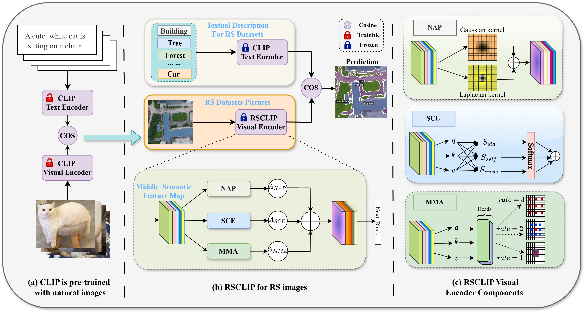

# RSCLIP
The code implementation of the RSCLIP.


### Environment
---
Please run the following script to install the SemiEarth runtime environment.
```
pip install -r requirements.txt
```

### Demo
---
Please run the following script to start the demo.
```
python3 demo_rsclip.py
python3 demo_mask.py
```

### Evaluation
---
Please run the following script to obtain the evaluation metrics.
```
python3 eval.py
python3 t_test.py
```

### Acknowledgments
Our work is based on [SegEarth‑OV](https://github.com/likyoo/SegEarth-OV). We thank the authors for their excellent open‑source contributions.

### Citation
---
If you find it useful, please consider citing:
```
@ARTICLE{11502025,
  author={Wang, Shanwen and Sun, Xin and Han, Jungong and Zhu, Xiao Xiang},
  journal={IEEE Journal of Selected Topics in Applied Earth Observations and Remote Sensing}, 
  title={RSCLIP for Training-Free Open-Vocabulary Remote Sensing Image Semantic Segmentation}, 
  year={2026},
  volume={},
  number={},
  pages={1-14},
  keywords={Circuits and systems;Filtering;Spatial filters;Filters;Pixel;Videos;Location awareness;Mobile communication;Video equipment;Communication systems;Open-vocabulary semantic segmentation;Remote sensing;Vision-language model;Training-Free},
  doi={10.1109/JSTARS.2026.3688939}}
```
